<div align="center">


[](https://git.io/typing-svg)

</div>

## About Me

```yaml
name: MEKXH
located_in: China
current_focus: Backend Development & AI Applications
fields_of_interests:
  [
    Backend Architecture,
    Artificial Intelligence,
    Big Data & Analytics,
    Cloud Native,
  ]
currently_learning:
  [Large Language Models, Distributed Systems, Data Engineering]
hobbies: [Open Source Contributing, Tech Blogging, Problem Solving]
```

## Tech Stack

<div align="center">

**Languages**&ensp;


**AI & Data**&ensp;


**Frontend**&ensp;


**Database & MQ**&ensp;


**DevOps & Tools**&ensp;


</div>

## GitHub Stats

<div align="center">
  
  
</div>

<div align="center">
  
</div>

<div align="center">
  <picture>
    <source media="(prefers-color-scheme: dark)" srcset="https://raw.githubusercontent.com/MEKXH/MEKXH/output/github-contribution-grid-snake-dark.svg"/>
    <source media="(prefers-color-scheme: light)" srcset="https://raw.githubusercontent.com/MEKXH/MEKXH/output/github-contribution-grid-snake.svg"/>
  </picture>
</div>

---

<div align="center">


</div>
